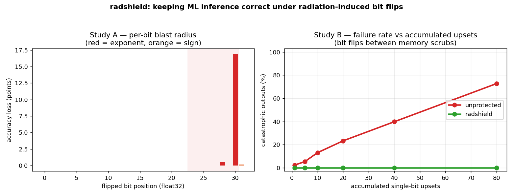

# radshield

**Fault-tolerant inference runtime for compute in harsh environments. ECC for your model.**

When a cosmic ray flips a bit in the memory holding your model's weights — a
*single-event upset* (SEU) — the value `0.01` can become `~1e30` or `NaN`, and
your model starts emitting garbage. Commodity GPUs (the kind now being flown in
orbit) do not have hardware ECC on every memory path, and bit flips accumulate
between memory scrubs. radshield detects and repairs corrupted weights and
contains corrupted activations, in software, on any chip — so inference stays
correct under radiation.

This matters today for orbital data centers and satellite edge compute, and
right now for safety-critical terrestrial AI (automotive, defense, avionics)
where the same failure mode appears at sea level.



*Left: flipping the top float32 exponent bit alone costs ~17 accuracy points;
every other bit is near-harmless — radshield exploits exactly this asymmetry.
Right: as upsets accumulate between scrubs, unprotected models fail
catastrophically up to ~73% of the time; radshield holds failures at 0%.*
(Reproduce with `python experiments/fault_campaign.py`.)

## Install

```bash
pip install -e .
```

## Use

```python
import radshield as rs

# 1. Protect weights: checksums + a verified golden copy.
guard = rs.WeightGuard(params)

# 2. Calibrate an output range once on clean data.
sanitize = rs.OutputSanitizer.from_calibration(clean_logits, margin=4.0)

# ---- during operation, per inference (or on a timer) ----
guard.verify_and_repair(params)        # detect drifted tensors, restore them
logits = sanitize(model_forward(x))    # clamp range + scrub NaN/Inf

# Validate your own protection by simulating radiation:
corrupted = rs.inject.inject_bit_flips(params["W1"], n_flips=5, region="exponent")
```

That's the whole v0 surface. Three primitives, near-zero overhead:
a checksum is a few MB/ms; sanitizing is one elementwise clip.

## How it works

A float32 is `[sign | 8 exponent bits | 23 mantissa bits]`. Flips in the high
exponent bits cause value explosions (the catastrophic case); mantissa flips are
nearly harmless. radshield combines two cheap, composable defenses:

- **WeightGuard** — per-tensor CRC checksums plus a verified golden reference.
  On mismatch, the tensor is restored. This is software ECC for your weights.
- **OutputSanitizer** — a last line of defense between checksum passes: clamps
  activations/outputs to a calibrated plausible range and removes NaN/Inf, so a
  flip occurring mid-inference cannot propagate an explosion to the user.

Redundant recompute (DMR/TMR) is intentionally *not* the default — it doubles
compute. radshield's bet is that detect-and-repair plus containment buys you
most of the reliability at a fraction of the cost.

## Roadmap

v0 (this repo) is the numpy reference implementation and the measurement harness.
Open-core direction:

- **Framework adapters** — PyTorch / JAX hooks so `WeightGuard` wraps an
  `nn.Module` and sanitization attaches to layers automatically.
- **Selective protection** — spend the checksum/redundancy budget only on the
  most sensitive layers and the most sensitive bits, guided by a profiler.
- **Quantization-aware guards** — int8/fp8 fault models for the chips that
  actually fly.
- **Telemetry** — structured logs of detected/repaired upsets, the dataset every
  operator and silicon team currently lacks.

The free core stays permissive (Apache-2.0). A later hardened/certified tier
with support targets operators and chipmakers who need it production-qualified.

## Status

Experimental. v0.0.1. Built to be torn apart — issues and PRs welcome.

## License

Apache-2.0.
